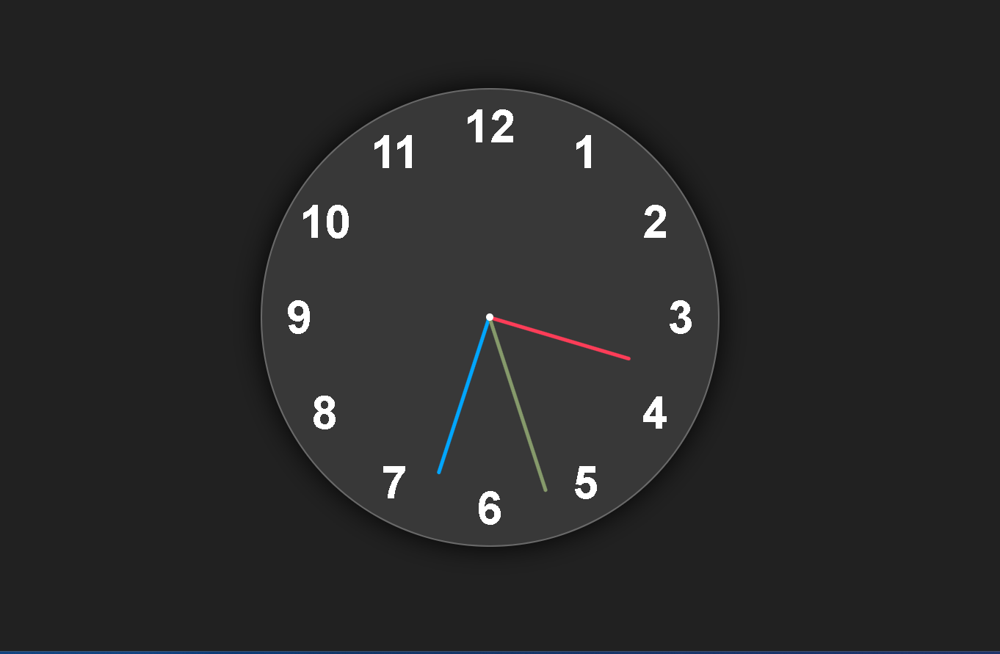

# Analog Clock Project

This repository contains a fully functional analog clock built using **HTML**, **CSS**, and **JavaScript**. The clock operates in real-time, displaying smooth movements for the hour, minute, and second hands, giving a dynamic visual representation of the current time.

## 🔧 Technologies Used

- **HTML**: Structuring the layout of the clock elements.
- **CSS**: Styling the clock, including the design of the clock face and positioning of the hands.
- **JavaScript**: Adding functionality to update the clock hands every second based on the current time.

## ✨ Features

- Displays real-time accurate time.
- Smooth animation for the clock hands (hours, minutes, seconds).
- Simple and responsive design.
- Lightweight and easy to integrate into any website or project.

## 📂 Project Structure

├── index.html         # Main HTML file   
├── style.css          # CSS for styling the clock      
├── script.js          # JavaScript logic for real-time functionality   
└── assets     
└── screenshot.png

## 🖥️ Live Demo
(https://github.com/itsalokbarnwal/realtime-analog-clock)

## 📸 Screenshots

Here's a preview of the analog clock:

## 🛠️ Installation and Usage

1. Clone the repository:
   
   https://github.com/itsalokbarnwal/realtime-analog-clock.git

2. Open `index.html` in your browser to see the clock in action.

3. Optionally, you can edit the `style.css` or `script.js` to customize the design or behavior.
